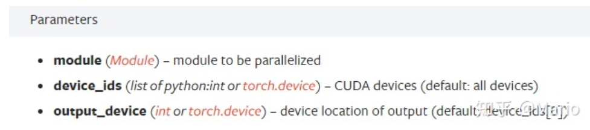

# torch.nn.DataParallel

> 参考链接：https://zhuanlan.zhihu.com/p/102697821

## 使用

当使用多卡GPU服务器，在上面跑程序的时候，当迭代次数或者epoch足够大的时候，通常会使用`nn.DataParallel`使用多个GPU加速训练，一般会在代码中加入以下几句：

```python
device_ids = [0, 1]
net = torch.nn.DataParallel(net, device_ids=device_ids)
```

## 多显卡显存占用

在terminal下执行`watch -n 1 nvidia-smi`会发现确实会使用多个GPU来并行训练，但第一块卡的显存会占用的多一些

```python
CLASS torch.nn.DataParallel(module, device_ids=None, output_device=None, dim=0)
```



output_device这个参数表示输出结果的device，而这最后一个参数output_device一般情况下是省略不写的，那么默认就是在device_ids[0]，也就是第一块卡上。当调用`nn.DataParallel`时，只是在input数据是并行的，但output loss却不是这样的，每次都会在第一块GPU相加计算，这就造成了第一块GPU的负载远大于剩余的其他显卡

## 工作原理

### 前向过程

输入数据会被划分成多个子部分（以下称为副本）送到不同device中进行计算，module在每个device上复制一份。输入的batch被平均分到每个device中，每个device只需要处理每个副本。**注：需要保证batch_size>GPU个数**。

### 反向传播过程

每个副本的梯度被累加到原始模块中

